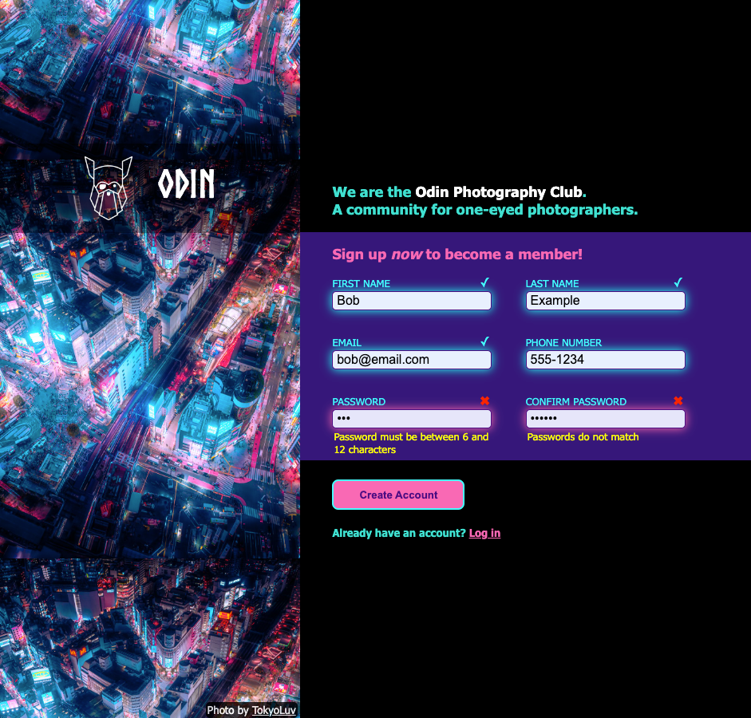

# odin-sign-up-form

**LIVE DEMO: https://olzcodes.github.io/odin-sign-up-form/**

The aim of this project was to build a basic sign-up form based on the prescribed format.

## Screenshots

## What I learned from this project

- How to build and style a basic form.
- How to validate form data on the client side.
- Forms play a critical role in gathering information from website users.
- It is possible to make forms more user-friendly by choosing the right input element for each piece of information.
- Styling form elements can greatly assist users in understanding what is required of them.
- Web browsers can help with validation but this can easily be bypassed. It is therefore important to sanitise form data on the server side.

## Credits

#### Background image

TokyoLuv https://twitter.com/TokyoLuv/status/1644119742784106496
